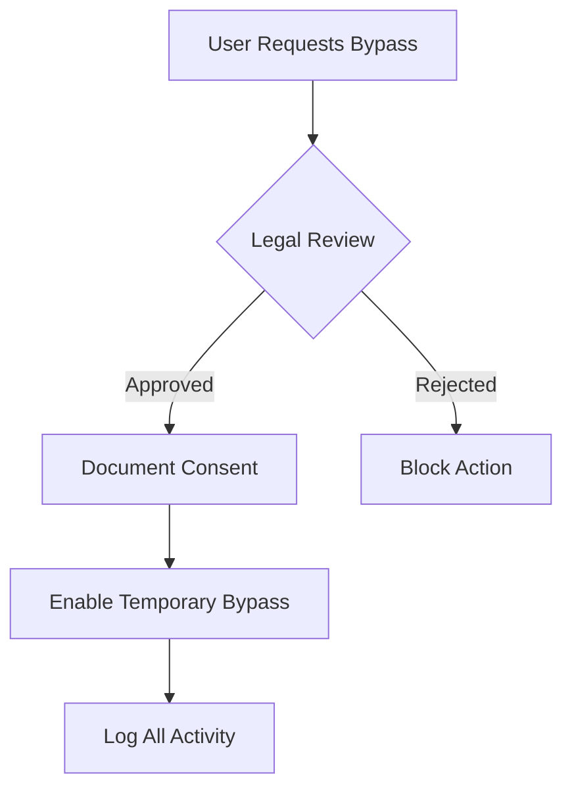

# Paywall Bypass Legal Framework

## Core Principles
1. **Default Disabled** - All bypass functionality disabled by default
2. **Explicit Consent** - Requires documented user consent per-domain
3. **Non-Redistribution** - Bypassed content cannot be redistributed
4. **Personal Use Only** - Strictly for individual access, not scraping

---

## Compliance Requirements

### User Consent Workflow


### Required Documentation
1. **Consent Records** - User/domain/date/timestamp
2. **Access Logs** - All bypass attempts with:
   - Timestamp
   - Domain
   - Method used
   - Content accessed
3. **Audit Trail** - Changes made to original content

---

## Implementation Safeguards

### Code-Level Protections
```python
class PaywallSystem:
    def __init__(self):
        self.enabled = False  # Hardcoded default
        self.require_legal_review = True

    def enable_for_domain(self, domain):
        if not self._validate_consent(domain):
            raise LegalComplianceError("Missing consent documentation")
        # ...
```

### Monitoring Systems
1. **Real-time Alerts** for:
   - Bulk access attempts
   - Unauthorized domains
   - Suspicious patterns
2. **Daily Reports** to legal team

---

## Risk Mitigation

### High-Risk Scenarios
| Scenario | Mitigation |
|----------|------------|
| Automated scraping | Rate limiting + CAPTCHA |
| Content redistribution | Watermarking + access logs |
| Legal takedown notice | Immediate disable system |

### Emergency Protocols
1. **Kill Switch** - Disables all bypasses globally
2. **Data Purge** - Removes cached bypassed content
3. **Audit Mode** - Locks system for legal review

---

## International Considerations

### Jurisdiction-Specific Rules
| Country | Key Requirement |
|---------|-----------------|
| USA | DMCA compliance |
| EU | GDPR data protection |
| Germany | Ancillary copyright |

### Recommended Implementation
```python
def check_jurisdiction(url):
    tld = extract_tld(url)
    if tld in HIGH_RISK_JURISDICTIONS:
        require_extra_consent()
```