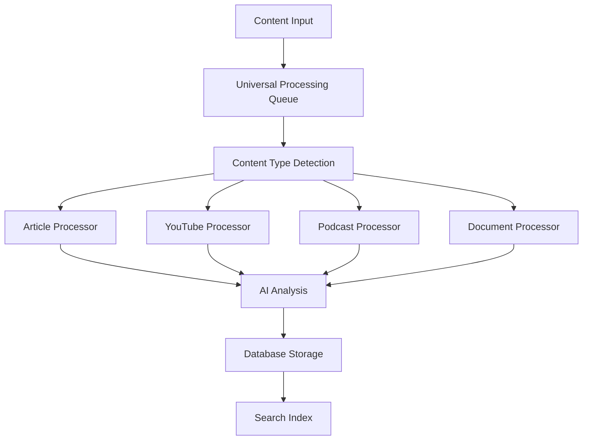

# Atlas Unified System Architecture

**Last Updated**: September 9, 2025
**Version**: 2.0 - Integrated System

## Table of Contents

1. [System Overview](#system-overview)
2. [Core Components](#core-components)
3. [Integration Architecture](#integration-architecture)
4. [Data Flow](#data-flow)
5. [Service Communication](#service-communication)
6. [External Dependencies](#external-dependencies)
7. [Security Architecture](#security-architecture)
8. [Scalability and Performance](#scalability-and-performance)

## System Overview

Atlas is a comprehensive personal AI knowledge system that combines multiple processing pipelines into a unified cognitive amplification platform. The system integrates YouTube processing, PODEMOS ad-free podcast feeds, Mac Mini audio processing, and traditional content ingestion into a seamless experience.

### Key Architectural Principles

- **Single Model Architecture**: Gemini 2.5 Flash Lite for all AI processing
- **Unified Processing Queue**: All content processing through shared queue system
- **Graceful Degradation**: System operates with partial component failures
- **Distributed Processing**: Optional Mac Mini for dedicated audio processing
- **Real-time Integration**: Live feed monitoring and processing

## Core Components

### 1. Atlas Core Engine

**Location**: `/home/ubuntu/dev/atlas/`
**Purpose**: Central orchestration and data management

```
atlas/
├── unified_service_manager.py      # Central service controller
├── universal_processing_queue.py   # Unified task processing
├── helpers/
│   ├── database_config.py          # Centralized database access
│   ├── ai_interface.py             # AI processing abstraction
│   └── semantic_search_ranker.py   # Content search and ranking
```

**Key Features**:
- Centralized database configuration eliminates hardcoded paths
- Bulletproof process management prevents memory leaks
- Universal content extraction and processing
- Semantic search with 240,026+ indexed items

### 2. Content Processing Pipeline

**Architecture**: Event-driven processing with queue-based task distribution



**Components**:
- **Universal Content Extractor**: Handles all content types
- **Quality Analysis System**: 6-dimension content evaluation
- **Automatic Reprocessing**: Improves failed/low-quality content
- **Metadata Management**: Consistent content categorization

### 3. YouTube Processing System

**Location**: `integrations/youtube_*`, `automation/youtube_*`, `helpers/youtube_*`

```
YouTube System/
├── integrations/
│   ├── youtube_api_client.py       # YouTube Data API v3 client
│   ├── youtube_content_processor.py # Video metadata processing
│   └── youtube_history_importer.py # History import functionality
├── automation/
│   └── youtube_history_scraper.py  # Browser automation backup
└── helpers/
    └── youtube_ingestor.py         # Atlas integration layer
```

**Processing Flow**:
1. **Subscription Monitoring**: Every 5 hours via YouTube Data API
2. **Video Discovery**: New videos from monitored channels
3. **Transcript Extraction**: Official captions → auto-generated → Mac Mini audio
4. **Content Integration**: Videos stored in Atlas with full metadata
5. **Rate Limiting**: Respects 10,000 API units/day with intelligent caching

### 4. PODEMOS Ad-Free Podcast System

**Location**: `podemos_*` files and related integrations

```
PODEMOS System/
├── podemos_scheduler.py            # Main orchestrator
├── podemos_feed_monitor.py         # Real-time feed monitoring
├── podemos_ultra_fast_processor.py # 19-minute processing pipeline
├── podemos_rss_server.py           # Private RSS feed hosting
├── podemos_atlas_integration.py    # Atlas database integration
└── podemos_transcription.py        # Mac Mini whisper integration
```

**Processing Architecture**:
1. **Feed Monitoring**: 1-2 minute polling of 191 podcast feeds
2. **Episode Detection**: Immediate download triggering
3. **Transcription**: Mac Mini Whisper processing
4. **Ad Detection**: 8-pattern AI-powered advertisement identification
5. **Audio Processing**: FFmpeg high-quality segment removal
6. **RSS Generation**: Clean feeds hosted on Oracle OCI
7. **2AM Processing**: Automated overnight episode processing

### 5. Mac Mini Audio Processing Infrastructure

**Location**: `helpers/mac_mini_client.py`, `scripts/mac_mini_worker.py`

```
Mac Mini Integration/
├── Atlas Server Side:
│   ├── helpers/mac_mini_client.py  # Task submission client
│   └── helpers/smart_dispatcher.py # Intelligent task routing
└── Mac Mini Side:
    ├── scripts/mac_mini_worker.py  # Worker daemon
    └── setup scripts/              # Installation automation
```

**Architecture Design**:
- **SSH Task Queue**: Secure file-based task distribution
- **Multiple Whisper Models**: tiny/base/small/medium for speed/quality optimization
- **Graceful Degradation**: Atlas continues if Mac Mini unavailable
- **Result Polling**: Efficient status checking and result retrieval
- **Auto Cleanup**: Automatic task file cleanup after completion

## Integration Architecture

### Unified Service Management

**Central Controller**: `unified_service_manager.py`

```python
# Service Coordination
services = {
    'atlas_core': AtlasCore(),
    'youtube_processor': YouTubeProcessor(),
    'podemos_system': PodmosSystem(),
    'mac_mini_client': MacMiniClient(),
    'api_server': FastAPIServer(),
    'feed_monitor': FeedMonitor()
}

# Coordinated startup/shutdown
manager.start_all_services()
```

**Benefits**:
- Single command service management
- Health monitoring across all components
- Coordinated resource sharing
- Failure isolation and recovery

### Shared Resource Management

**Database Integration**:
```python
# Centralized database configuration
from helpers.database_config import get_database_connection

# All components use same database instance
conn = get_database_connection()
```

**Processing Queue Integration**:
```python
# Unified task processing
from universal_processing_queue import UniversalQueue

queue = UniversalQueue()
queue.add_task('youtube_video', video_data)
queue.add_task('podcast_episode', episode_data)
queue.add_task('mac_mini_transcription', audio_data)
```

## Data Flow

### Content Ingestion Flow

```
┌─────────────────┐    ┌──────────────────┐    ┌─────────────────┐
│   Content       │    │   Processing     │    │   Storage &     │
│   Sources       │    │   Pipeline       │    │   Analysis      │
└─────────────────┘    └──────────────────┘    └─────────────────┘
         │                        │                        │
    ┌────▼────┐              ┌───▼────┐              ┌────▼────┐
    │YouTube  │              │Universal│              │Database │
    │Videos   │──────────────│Queue    │──────────────│Storage  │
    └─────────┘              │System   │              └─────────┘
         │                   └─────────┘                   │
    ┌────▼────┐                   │                  ┌────▼────┐
    │Podcast  │                   │                  │Search   │
    │Episodes │───────────────────┘                  │Index    │
    └─────────┘                   │                  └─────────┘
         │                        │                        │
    ┌────▼────┐                   │                  ┌────▼────┐
    │Web      │                   │                  │AI       │
    │Articles │───────────────────┘                  │Analysis │
    └─────────┘                                      └─────────┘
```

### Processing Coordination

1. **Content Detection**: Sources monitored continuously
2. **Queue Submission**: All content routed through universal queue
3. **Processing Assignment**: Tasks distributed based on type and availability
4. **AI Analysis**: Gemini 2.5 Flash Lite processes all content
5. **Storage**: Centralized database with consistent schema
6. **Indexing**: Semantic search index updated in real-time

## Service Communication

### API Layer Architecture

**FastAPI Main Server** (`api/main.py`):
- **Port**: Configurable via .env (default 7444)
- **Authentication**: JWT tokens and API keys
- **CORS**: Configured for mobile and browser access
- **Documentation**: Auto-generated OpenAPI specs

**Router Organization**:
```
/api/v1/
├── auth/           # Authentication and authorization
├── content/        # Content management and CRUD
├── cognitive/      # AI cognitive features
├── transcripts/    # Transcript search and discovery
├── transcriptions/ # Mac Mini transcription results
├── worker/         # Distributed task management
├── podcast-progress/ # PODEMOS monitoring
├── shortcuts/      # Apple integration
├── youtube/        # YouTube processing control
└── macmini/        # Mac Mini coordination
```

### Inter-Service Communication

**Shared Database**: All services read/write through centralized database config
**Message Passing**: Queue-based task distribution
**File-based Communication**: Mac Mini uses SSH file transfer
**HTTP APIs**: External services (YouTube, OCI) via REST APIs

## External Dependencies

### Required Services

1. **OpenRouter API**
   - **Purpose**: Gemini 2.5 Flash Lite AI processing
   - **Usage**: All cognitive features and content analysis
   - **Cost**: ~$0.05/1M tokens
   - **Fallback**: None (required for core functionality)

### Optional Services

2. **YouTube Data API v3**
   - **Purpose**: Video discovery and metadata
   - **Usage**: 500-2000 units/day typical
   - **Cost**: Free (10,000 units/day)
   - **Fallback**: Manual video URL processing

3. **Oracle Cloud Infrastructure**
   - **Purpose**: PODEMOS RSS feed hosting
   - **Usage**: Private podcast feed delivery
   - **Cost**: Free tier available
   - **Fallback**: Local RSS file generation

4. **Mac Mini Hardware**
   - **Purpose**: Dedicated Whisper transcription
   - **Usage**: High-quality audio processing
   - **Cost**: Hardware only
   - **Fallback**: Local transcription processing

## Security Architecture

### Authentication and Authorization

**JWT Token System**:
- User authentication for web interfaces
- Token expiration and refresh handling
- Role-based access control

**API Key Management**:
- Service-to-service authentication
- Key rotation and revocation
- Rate limiting per API key

### Data Security

**Database Security**:
- SQLite with file-level permissions
- Centralized connection management
- Backup encryption available

**External API Security**:
- API keys stored in environment variables
- HTTPS-only communication
- Rate limiting and quota management

**Mac Mini Integration Security**:
- SSH key-based authentication
- File-based task isolation
- Automatic cleanup of sensitive data

### Network Security

**CORS Configuration**:
- Restricted origins for production
- Credential handling for authenticated requests
- Method and header restrictions

**Port Management**:
- Configurable service ports
- Firewall-friendly default configuration
- Optional port binding restrictions

## Scalability and Performance

### Horizontal Scaling Options

**Multiple Mac Minis**:
- SSH-based worker pool expansion
- Load distribution across hardware
- Independent failure isolation

**Database Scaling**:
- SQLite for single-server deployments
- Migration path to PostgreSQL for multi-server
- Read replica support planning

**Processing Queue Scaling**:
- Task distribution across worker pools
- Priority-based processing queues
- Background vs real-time task separation

### Performance Optimizations

**Content Processing**:
- Parallel processing with concurrency limits
- Intelligent caching and deduplication
- Quality-based reprocessing priorities

**Search Performance**:
- Semantic index optimization
- Query result caching
- Mobile-optimized response sizes

**Resource Management**:
- Memory leak prevention system
- Process lifecycle management
- Automatic cleanup and recovery

### Monitoring and Observability

**System Health Monitoring**:
```bash
python3 atlas_status.py --detailed    # Comprehensive health check
python3 helpers/resource_monitor.py   # Resource usage monitoring
```

**Service-Specific Monitoring**:
- YouTube API quota usage tracking
- PODEMOS processing pipeline status
- Mac Mini connection and performance
- Database query performance metrics

**Alert System**:
- Processing failure notifications
- Resource limit warnings
- External service availability alerts
- Performance degradation detection

## Deployment Architecture

### Single Server Deployment (Current)

```
Ubuntu Server
├── Atlas Core Application
├── FastAPI Web Server
├── SQLite Database
├── Processing Queue System
├── Scheduler Services
└── Log Management
```

**External Connections**:
- Mac Mini via SSH (optional)
- Oracle OCI via HTTPS (optional)
- YouTube API via HTTPS (optional)
- OpenRouter API via HTTPS (required)

### Future Multi-Server Architecture

**Load Balancer** → **Atlas Servers** → **Shared Database**
                ↓
       **Dedicated Worker Pool**
                ↓
         **Mac Mini Cluster**

## Configuration Management

### Environment Configuration

**Core Settings** (`.env`):
```bash
# Database
DATABASE_URL=sqlite:///atlas.db
DATABASE_BACKUP_ENABLED=true

# API Server
API_HOST=localhost
API_PORT=7444

# AI Processing
OPENROUTER_API_KEY=sk-or-v1-...
DEFAULT_MODEL=google/gemini-2.5-flash-lite

# Optional Integrations
YOUTUBE_API_KEY=...
MAC_MINI_ENABLED=true
PODEMOS_ENABLED=true
```

**Feature Toggles**:
- Component-level enable/disable flags
- Graceful degradation configuration
- Development vs production modes

### Service Discovery

**Internal Services**:
- Database connection via configuration helper
- Queue system auto-discovery
- Mac Mini SSH configuration

**External Services**:
- API endpoint configuration
- Authentication credential management
- Retry and timeout configuration

---

**Architecture Evolution**: This unified architecture represents the consolidation of Atlas from a collection of independent systems into a cohesive, production-ready platform. The integration maintains backward compatibility while providing new capabilities through shared infrastructure and coordinated service management.