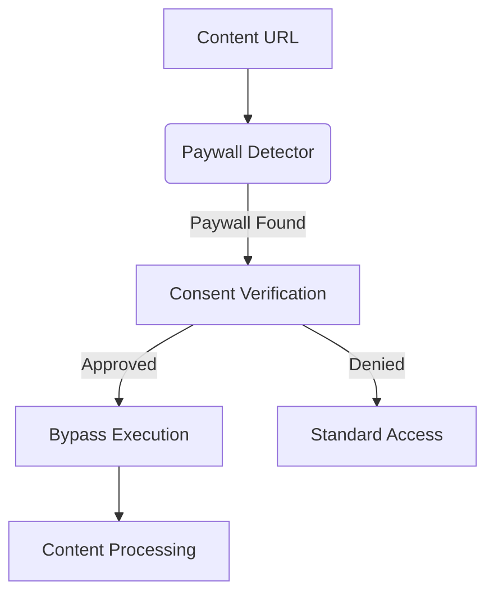

# Atlas Implementation Guide

## Overview

This guide provides comprehensive implementation guidance for Atlas development, covering both new feature development and migration from legacy systems. Atlas is designed to be a resilient, modular system that can handle AI crashes and restarts while maintaining development momentum.

## Development Philosophy

### Core Principles
- **Resilient Development**: Every task should be resumable after interruption
- **Modular Architecture**: Clear separation of concerns with well-defined interfaces
- **Test-Driven Development**: Comprehensive testing at all levels
- **Documentation-First**: All APIs and modules fully documented before implementation
- **Incremental Progress**: Small, committable changes that build toward larger goals

### Git Commit Strategy

#### Commit Frequency
- **After each new module/file creation**: Individual commits for new files
- **After each major feature completion**: Comprehensive commits for completed functionality
- **After each task completion**: Summary commits marking task completion
- **Before major refactoring**: Checkpoint commits to enable rollback

#### Commit Message Format
```
[TASK-ID] Brief description

Detailed description of changes:
- What was implemented
- Key architectural decisions
- Testing status
- Documentation updates

Related files:
- New files created
- Modified files
- Deleted files (if any)
```

## Architecture Overview

### New Architecture Components

#### 1. **Article Strategies (`helpers/article_strategies.py`)**
- **Purpose**: Modular article fetching using strategy pattern
- **Benefits**: Easier testing, maintenance, and adding new fetching methods
- **Pattern**: Strategy pattern with fallback mechanisms

#### 2. **Error Handler (`helpers/error_handler.py`)**
- **Purpose**: Centralized error handling and categorization
- **Benefits**: Consistent error reporting, automatic retry logic, severity tracking
- **Features**: Error categorization, retry mechanisms, logging integration

#### 3. **Metadata Manager (`helpers/metadata_manager.py`)**
- **Purpose**: Standardized metadata structure and operations
- **Benefits**: Consistent data structure, easier querying, better type safety
- **Schema**: Unified metadata schema across all content types

#### 4. **Path Manager (`helpers/path_manager.py`)**
- **Purpose**: Centralized file path management
- **Benefits**: Consistent path handling, backup capabilities, easier migrations
- **Features**: Path validation, backup creation, migration support

#### 5. **Base Ingestor (`helpers/base_ingestor.py`)**
- **Purpose**: Shared functionality for all ingestors
- **Benefits**: Consistent interfaces, reduced code duplication, easier maintenance
- **Pattern**: Template method pattern with hooks for customization

## Implementation Phases

### Phase 1: Foundation (FOUNDATION-1 through FOUNDATION-5)

#### FOUNDATION-1: Testing Infrastructure

**Objective**: Create comprehensive testing framework with pytest, fixtures, and mocks

**Deliverables**:
1. `tests/` directory structure
2. `pytest.ini` configuration
3. Test fixtures for common scenarios
4. Mock implementations for external services
5. Test utilities and helpers
6. CI/CD integration setup

**Implementation Steps**:

1. **Create test directory structure**
   ```
   tests/
   ├── __init__.py
   ├── conftest.py
   ├── fixtures/
   │   ├── __init__.py
   │   ├── article_fixtures.py
   │   ├── metadata_fixtures.py
   │   └── content_fixtures.py
   ├── mocks/
   │   ├── __init__.py
   │   ├── mock_services.py
   │   └── mock_responses.py
   ├── unit/
   │   ├── __init__.py
   │   ├── test_article_strategies.py
   │   ├── test_error_handler.py
   │   ├── test_metadata_manager.py
   │   └── test_path_manager.py
   ├── integration/
   │   ├── __init__.py
   │   ├── test_pipeline.py
   │   └── test_end_to_end.py
   └── performance/
       ├── __init__.py
       └── test_performance.py
   ```

2. **Configure pytest**
   ```ini
   [tool:pytest]
   testpaths = tests
   python_files = test_*.py
   python_classes = Test*
   python_functions = test_*
   addopts = -v --tb=short --strict-markers
   markers =
       unit: Unit tests
       integration: Integration tests
       performance: Performance tests
       slow: Slow tests
   ```

3. **Create test fixtures**
   ```python
   # tests/conftest.py
   import pytest
   from pathlib import Path
   from helpers.metadata_manager import MetadataManager
   from helpers.path_manager import PathManager

   @pytest.fixture
   def temp_output_dir(tmp_path):
       """Create temporary output directory for tests."""
       return tmp_path / "output"

   @pytest.fixture
   def metadata_manager(temp_output_dir):
       """Create MetadataManager instance for testing."""
       return MetadataManager(temp_output_dir)

   @pytest.fixture
   def sample_article_data():
       """Sample article data for testing."""
       return {
           "title": "Test Article",
           "url": "https://example.com/test",
           "content": "This is test content",
           "author": "Test Author",
           "published_date": "2024-01-01"
       }
   ```

#### FOUNDATION-2: Performance Monitoring

**Objective**: Implement comprehensive performance monitoring and optimization

**Deliverables**:
1. Performance metrics collection
2. Memory usage monitoring
3. Processing time tracking
4. Resource utilization alerts
5. Performance regression detection

#### FOUNDATION-3: Enhanced Error Handling

**Objective**: Implement sophisticated error handling with categorization and recovery

**Deliverables**:
1. Error categorization system
2. Automatic retry mechanisms
3. Error recovery strategies
4. Comprehensive error logging
5. Error analytics and reporting

#### FOUNDATION-4: Configuration Management

**Objective**: Centralized configuration management with environment-specific settings

**Deliverables**:
1. Configuration schema validation
2. Environment-specific configurations
3. Runtime configuration updates
4. Configuration migration tools
5. Security-aware configuration handling

#### FOUNDATION-5: Enhanced Content Processing

**Objective**: Improve content processing with better extraction and analysis

**Deliverables**:
1. Multi-strategy content extraction
2. Content quality assessment
3. Metadata enrichment
4. Content deduplication
5. Processing pipeline optimization

## Migration Guide

### Overview of Changes

The Atlas system has been significantly refactored to improve:
- **Modularity**: Clear separation of concerns with dedicated modules
- **Error Handling**: Centralized error management with categorization and retry logic
- **Metadata Management**: Standardized metadata structure across all content types
- **Path Management**: Centralized file path handling with backup capabilities
- **Code Reuse**: Base classes to reduce duplication across ingestors

### Migration Steps

#### Step 1: Update Imports

**Old:**
```python
from helpers.utils import log_error, log_info
from helpers.article_fetcher import fetch_and_save_article
```

**New:**
```python
from helpers.error_handler import ErrorHandler
from helpers.article_strategies import ArticleStrategies
from helpers.metadata_manager import MetadataManager
from helpers.path_manager import PathManager
```

#### Step 2: Update Error Handling

**Old:**
```python
try:
    result = some_operation()
except Exception as e:
    log_error(f"Operation failed: {e}")
    return None
```

**New:**
```python
from helpers.error_handler import ErrorHandler, ErrorCategory

error_handler = ErrorHandler(config)
try:
    result = some_operation()
except Exception as e:
    error_handler.handle_error(e, ErrorCategory.PROCESSING, context="operation_name")
    return None
```

#### Step 3: Update Metadata Handling

**Old:**
```python
metadata = {
    "title": title,
    "url": url,
    "timestamp": datetime.now().isoformat()
}
```

**New:**
```python
from helpers.metadata_manager import MetadataManager

metadata_manager = MetadataManager(config=config)
metadata = metadata_manager.create_metadata(
    title=title,
    url=url,
    content_type="article",
    source="web"
)
```

#### Step 4: Update Path Management

**Old:**
```python
import os
output_file = os.path.join(output_dir, f"{safe_filename}.json")
```

**New:**
```python
from helpers.path_manager import PathManager

path_manager = PathManager(config)
output_file = path_manager.get_content_path(safe_filename, "json")
```

#### Step 5: Update Ingestor Classes

**Old:**
```python
class ArticleIngestor:
    def __init__(self, output_dir):
        self.output_dir = output_dir

    def process(self, url):
        # Custom processing logic
        pass
```

**New:**
```python
from helpers.base_ingestor import BaseIngestor

class ArticleIngestor(BaseIngestor):
    def __init__(self, output_dir):
        super().__init__(output_dir, "article")

    def _process_content(self, content):
        # Custom processing logic
        return processed_content
```

## Testing Strategy

### Unit Testing

**Coverage Target**: 90% minimum

**Key Areas**:
1. **Error Handling**: All error scenarios and recovery paths
2. **Metadata Management**: Schema validation and operations
3. **Path Management**: Path generation and validation
4. **Content Processing**: All extraction strategies
5. **Configuration**: All configuration scenarios

**Example Unit Test**:
```python
def test_metadata_manager_create_metadata(metadata_manager, sample_article_data):
    """Test metadata creation with valid data."""
    metadata = metadata_manager.create_metadata(
        title=sample_article_data["title"],
        url=sample_article_data["url"],
        content_type="article",
        source="web"
    )

    assert metadata["title"] == sample_article_data["title"]
    assert metadata["url"] == sample_article_data["url"]
    assert metadata["content_type"] == "article"
    assert metadata["source"] == "web"
    assert "created_at" in metadata
    assert "id" in metadata
```

### Integration Testing

**Objective**: Test module interactions and end-to-end workflows

**Key Scenarios**:
1. **Full Pipeline**: URL to final output
2. **Error Recovery**: Handling of various failure modes
3. **Performance**: Processing time and resource usage
4. **Data Integrity**: Consistency across all operations

**Example Integration Test**:
```python
def test_article_processing_pipeline(temp_output_dir):
    """Test complete article processing pipeline."""
    from ingest.link_dispatcher import LinkDispatcher

    dispatcher = LinkDispatcher(temp_output_dir)
    result = dispatcher.process_url("https://example.com/test-article")

    assert result["success"] is True
    assert result["output_file"].exists()
    assert result["metadata"]["content_type"] == "article"
```

### Performance Testing

**Objectives**:
1. **Throughput**: Process 100+ articles per hour
2. **Memory Usage**: Stay under 1GB for 10k articles
3. **Response Time**: Average processing time under 30 seconds
4. **Scalability**: Linear performance scaling

**Example Performance Test**:
```python
import time
import psutil
import pytest

@pytest.mark.performance
def test_article_processing_performance():
    """Test article processing performance."""
    start_time = time.time()
    start_memory = psutil.Process().memory_info().rss

    # Process test articles
    results = []
    for i in range(100):
        result = process_test_article(f"test-article-{i}")
        results.append(result)

    end_time = time.time()
    end_memory = psutil.Process().memory_info().rss

    # Performance assertions
    processing_time = end_time - start_time
    memory_usage = end_memory - start_memory

    assert processing_time < 300  # 5 minutes for 100 articles
    assert memory_usage < 100 * 1024 * 1024  # 100MB max increase
    assert all(r["success"] for r in results)
```

## Ingestor Modernization Status (July 2025)

All major ingestion modules are now unified under the new architecture:
- **PodcastIngestor** (class-based, robust error handling, tested)
- **YouTubeIngestor** (class-based, robust error handling, tested)
- **InstapaperIngestor** (class-based, robust error handling, tested; API integration pending)
- **ArticleFetcher/ArticleStrategies** (modular, tested)

### Test Coverage
- Direct unit tests exist for all ingestors in `tests/unit/`.
- Tests cover initialization, metadata, error handling, and batch/single ingestion logic using mocks.
- To add a new ingestor, inherit from `BaseIngestor`, implement required methods, and add a test file in `tests/unit/` following the existing style.

### Next Steps
- Expand integration tests and end-to-end pipeline tests.
- Proceed to advanced features (cognitive amplification, proactive intelligence, etc.) once Instapaper API is available.

## Integration Tests for Pipeline and Scheduler Edge Cases

- New integration tests in `tests/integration/test_pipeline_edge_cases.py` cover:
  - Running the full pipeline via the correct entrypoint (`ingest/ingest_main.py`)
  - Handling config errors, missing directories, and output path mismatches
  - Scheduler job persistence and error handling (including non-serializable objects)
  - Evaluation file generation and output location correctness

## Cognitive Amplification (Ask) Subsystems: Implementation Complete

The following core subsystems are now implemented and directly tested:

- **ProactiveSurfacer**: Surfaces forgotten/stale content for review or re-engagement. Methods: `surface_forgotten_content`, `mark_surfaced`. Tested in `test_proactive_surfacer.py`.
- **TemporalEngine**: Finds time-aware relationships between content items. Method: `get_time_aware_relationships`. Tested in `test_temporal_engine.py`.
- **QuestionEngine**: Generates Socratic questions from content to prompt deeper thinking. Method: `generate_questions`. Tested in `test_question_engine.py`.
- **RecallEngine**: Schedules spaced repetition for active recall and knowledge retention. Methods: `schedule_spaced_repetition`, `mark_reviewed`. Tested in `test_recall_engine.py`.
- **PatternDetector**: Detects common tags and sources, surfacing patterns and insights. Method: `find_patterns`. Tested in `test_pattern_detector.py`.

All subsystems have robust, passing unit tests. The cognitive amplification foundation is now complete and ready for integration, UI, and advanced feature development.

## Cognitive Amplification (Ask) Subsystems: End-to-End Implementation & UI

### Architecture
- All core Ask subsystems (ProactiveSurfacer, TemporalEngine, QuestionEngine, RecallEngine, PatternDetector) are implemented, tested, and integrated.
- Subsystems are accessible via both API endpoints and a unified web dashboard (`/ask/html`).

### API Endpoints
- `/ask/proactive` (GET): JSON, surfaces forgotten/stale content.
- `/ask/temporal` (GET): JSON, shows time-aware content relationships.
- `/ask/socratic` (POST): JSON, generates Socratic questions from content.
- `/ask/recall` (GET): JSON, shows most overdue items for spaced repetition.
- `/ask/patterns` (GET): JSON, shows top tags and sources.

### Dashboard UI
- `/ask/html`: Interactive dashboard with navigation for all cognitive features.
- Each feature displays results in a user-friendly format.
- Socratic question generator supports interactive form submission.

### Usage Instructions
- Start the web server: `uvicorn web.app:app --reload --port 8000`
- Visit `https://atlas.khamel.com/ask/html` in your browser.
- Use the navigation bar to explore each cognitive feature.
- For Socratic questions, paste content and submit the form.

### Testing
- All subsystems have dedicated unit tests in `tests/unit/`.
- Integration and UI tested via live server and API endpoints.

### Extending Cognitive Features
- Add new subsystems in `ask/` and expose via API and dashboard.
- Update `web/app.py` and `ask_dashboard.html` to add new features.
- Follow the pattern of existing subsystems for testability and UI integration.

### Contributor Notes
- Keep documentation and UI in sync with code changes.
- All endpoints and UI features should be covered by tests and usage examples.
- See `PROJECT_ROADMAP.md` for future cognitive feature plans.

## Paywall System Integration

### Architecture


### Required Components
1. `helpers/paywall.py` - Core detection/bypass logic
2. `config/paywall_patterns.json` - Updatable pattern database
3. `legal/consent_manager.py` - Consent tracking system

### Implementation Checklist
- [ ] Create base paywall detector class
- [ ] Implement pattern loading system
- [ ] Add legal consent verification
- [ ] Develop bypass methods
- [ ] Create audit logging system

### Testing Protocol
```bash
python -m pytest tests/paywall/ \
  --test-domains=nytimes.com,wsj.com \
  --legal-review \
  --audit-log=paywall_test.log
```

### Security Considerations
- All bypasses must be logged
- No persistent storage of bypassed content
- Automatic expiration of consent (30 days default)

## Development Workflow

### Setting Up Development Environment

1. **Clone and Setup**:
   ```bash
   git clone <repository-url>
   cd atlas
   python -m venv venv
   source venv/bin/activate  # On Windows: venv\Scripts\activate
   pip install -r requirements.txt
   ```

2. **Install Development Dependencies**:
   ```bash
   pip install pytest pytest-cov black isort mypy
   ```

3. **Configure Pre-commit Hooks**:
   ```bash
   pip install pre-commit
   pre-commit install
   ```

### Development Process

1. **Create Feature Branch**:
   ```bash
   git checkout -b feature/your-feature-name
   ```

2. **Implement with Tests**:
   - Write tests first (TDD approach)
   - Implement functionality
   - Ensure all tests pass
   - Maintain code coverage above 90%

3. **Code Quality Checks**:
   ```bash
   # Format code
   black .
   isort .

   # Type checking
   mypy .

   # Run tests
   pytest --cov=. --cov-report=html
   ```

4. **Commit and Push**:
   ```bash
   git add .
   git commit -m "[TASK-ID] Brief description"
   git push origin feature/your-feature-name
   ```

5. **Create Pull Request**:
   - Ensure all CI checks pass
   - Request review from team members
   - Address feedback and merge

### Debugging and Troubleshooting

#### Common Issues

1. **Import Errors**:
   - Check Python path configuration
   - Verify module structure
   - Ensure all `__init__.py` files exist

2. **Test Failures**:
   - Check fixture dependencies
   - Verify mock configurations
   - Ensure test isolation

3. **Performance Issues**:
   - Profile with `cProfile`
   - Check memory usage with `memory_profiler`
   - Optimize database queries

#### Debugging Tools

1. **Python Debugger**:
   ```python
   import pdb; pdb.set_trace()
   ```

2. **Rich Console for Debugging**:
   ```python
   from rich.console import Console
   console = Console()
   console.print(variable, style="bold red")
   ```

3. **Logging Configuration**:
   ```python
   import logging
   logging.basicConfig(level=logging.DEBUG)
   ```

## Best Practices

### Code Style

1. **Follow PEP 8**: Use black and isort for formatting
2. **Type Hints**: Use type hints for all function signatures
3. **Docstrings**: Document all public functions and classes
4. **Error Handling**: Use specific exception types
5. **Constants**: Define constants at module level

### Architecture Patterns

1. **Strategy Pattern**: For content extraction methods
2. **Template Method**: For ingestor base classes
3. **Factory Pattern**: For creating different content types
4. **Observer Pattern**: For event notifications
5. **Dependency Injection**: For testability

### Performance Optimization

1. **Lazy Loading**: Load data only when needed
2. **Caching**: Cache expensive operations
3. **Batch Processing**: Process multiple items together
4. **Async Operations**: Use async for I/O operations
5. **Memory Management**: Clean up resources properly

## Security Considerations

### Data Protection

1. **Input Validation**: Validate all user inputs
2. **Path Traversal**: Prevent directory traversal attacks
3. **File Permissions**: Set appropriate file permissions
4. **Sensitive Data**: Never log sensitive information
5. **Encryption**: Encrypt sensitive data at rest

### Network Security

1. **HTTPS Only**: Always use HTTPS for external requests
2. **Request Validation**: Validate all external responses
3. **Rate Limiting**: Implement rate limiting for API calls
4. **User Agent**: Use appropriate user agent strings
5. **Timeout Handling**: Set reasonable timeouts

## Deployment and Operations

### Environment Configuration

1. **Development**: Full logging, debug mode enabled
2. **Testing**: Isolated environment, mock external services
3. **Production**: Optimized performance, error tracking
4. **Staging**: Production-like environment for testing

### Monitoring and Alerting

1. **Health Checks**: Implement health check endpoints
2. **Metrics Collection**: Track key performance indicators
3. **Error Tracking**: Monitor and alert on errors
4. **Resource Usage**: Monitor CPU, memory, and disk usage
5. **Log Aggregation**: Centralize log collection and analysis

### Backup and Recovery

1. **Data Backup**: Regular backups of all data
2. **Configuration Backup**: Version control all configurations
3. **Disaster Recovery**: Plan for system recovery
4. **Testing**: Regularly test backup and recovery procedures
5. **Documentation**: Maintain recovery procedures documentation

## Future Enhancements

### Planned Features

1. **Enhanced Content Intelligence**: Multi-method extraction, quality scoring
2. **Cognitive Amplification**: Proactive intelligence, temporal analysis
3. **Plugin Architecture**: Extensible plugin system
4. **Real-time Processing**: Event-driven processing pipeline
5. **Self-healing Systems**: Automatic error recovery

### Technical Debt

1. **Legacy Module Migration**: Complete migration of all legacy modules
2. **API Consistency**: Ensure all APIs follow consistent patterns
3. **Performance Optimization**: Optimize critical performance paths
4. **Documentation**: Complete API documentation
5. **Testing**: Achieve 100% test coverage

This implementation guide provides the foundation for successful Atlas development. Follow these patterns and practices to ensure consistent, maintainable, and high-quality code.

## Contributor Onboarding & First Steps

Welcome to Atlas! This section will help you get started as a new contributor.

### Project Philosophy
- Atlas is a local-first, privacy-respecting, cognitive amplification platform.
- Every feature should help users think better, not just store more.
- Documentation, code, and UI must always be kept in sync.

### Codebase Structure
- `run.py`: Main pipeline entrypoint for ingestion.
- `web/`: FastAPI web UI and dashboard (`/ask/html`).
- `ask/`: Cognitive amplification subsystems (proactive, temporal, Socratic, recall, patterns).
- `helpers/`: Ingestors, metadata, and utility modules.
- `tests/`: Unit and integration tests for all major features.
- `docs/`: All documentation, philosophy, and roadmap files.

### How to Run the System
1. Install dependencies:
   ```bash
   pip install -r requirements.txt
   pip install -r web/requirements.txt
   ```
2. Start the web server:
   ```bash
   uvicorn web.app:app --reload --port 8000
   ```
3. Visit the dashboard:
   [https://atlas.khamel.com/ask/html](https://atlas.khamel.com/ask/html)
4. Run the ingestion pipeline (optional):
   ```bash
   python run.py --all
   ```

### Adding New Cognitive Features
- Add a new module in `ask/` (see existing subsystems for examples).
- Expose it via an API endpoint in `web/app.py` and add a UI section in `ask_dashboard.html`.
- Write unit tests in `tests/unit/`.
- Update documentation and the dashboard navigation.

### Writing and Running Tests
- Unit tests: `pytest tests/unit/`
- Integration tests: `pytest tests/integration/`
- All tests should pass before submitting a PR.

### Where to Find Help
- `docs/IMPLEMENTATION_GUIDE.md`: Technical details and architecture.
- `docs/PROJECT_ROADMAP.md`: Current status and future plans.
- `docs/COGNITIVE_AMPLIFICATION_PHILOSOPHY.md`: Core philosophy and design principles.
- `README.md`: Quickstart and feature overview.

### First Contribution Checklist
- [ ] Read the project philosophy and roadmap.
- [ ] Set up the dev environment and run the dashboard.
- [ ] Explore the codebase and documentation.
- [ ] Add or improve a test, doc, or feature.
- [ ] Submit a pull request via GitHub (no direct pushes to main).

Welcome aboard! Your contributions help make Atlas smarter and more empowering for everyone.